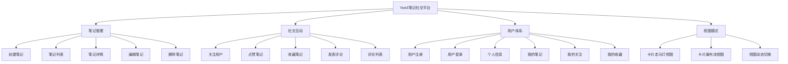

# Vue3 笔记社交平台 - 完整设计文档

## 📋 项目概述

本文档记录了 Vue3 笔记社交平台的完整设计与实施流程，包括所有功能模块的架构设计和技术实现。

**项目定位**：类小红书的笔记社交平台

**核心功能模块**：

- 📝 **笔记管理**：创建、编辑、删除、详情、列表展示
- 🖼️ **多媒体封面**：支持多图/视频，混合模式（手动+自动提取）
- ✍️ **富文本编辑**：增强版 Markdown 编辑器，表情选择器
- 📱 **视图模式**：走马灯卡片、瀑布流布局、视图动态切换
- 👥 **社交互动**：关注/取消关注、点赞、收藏、评论
- 🔐 **用户体系**：注册、登录（用户名/邮箱双模式）、个人信息
- 📂 **分类管理**：侧边栏分类导航

**技术栈**：

- Vue 3 + TypeScript + Vite
- Element Plus UI 组件库
- Pinia 状态管理
- Vue Router 路由
- vuedraggable 拖拽排序
- Axios 网络请求

**最后更新时间**：2026-02-26

---

## 📊 系统架构

### 整体功能架构



### 页面路由结构

```
/home                - 首页（走马灯/瀑布流）
├─ /note/:id         - 笔记详情
├─ /note/create      - 创建笔记
├─ /my-notes         - 我的笔记
├─ /favorites        - 我的收藏
├─ /following        - 我的关注
├─ /profile          - 个人信息
└─ /404              - 404 页面
```

### 状态管理架构

```
store/
├─ index.ts              - Pinia 根配置
└─ modules/
    ├─ user.ts           - 用户状态（登录、个人信息）
    ├─ note.ts           - 笔记状态（列表、详情、操作）
    ├─ social.ts         - 社交状态（关注、点赞、收藏、评论）
    └─ folder.ts         - 文件夹/分类状态
```

### 组件层级结构

```
App.vue
├─ layout/index.vue (主布局)
│   ├─ Header.vue (顶部导航)
│   └─ CategorySidebar.vue (侧边栏分类)
│
├─ views/ (页面组件)
│   ├─ home/index.vue (首页)
│   ├─ note/create.vue (创建笔记)
│   ├─ note/detail.vue (笔记详情)
│   ├─ my-notes/index.vue (我的笔记)
│   ├─ favorites/index.vue (我的收藏)
│   ├─ following/index.vue (我的关注)
│   ├─ profile/index.vue (个人信息)
│   └─ 404/index.vue (404页面)
│
└─ components/ (通用组件)
    ├─ NoteCard.vue (笔记卡片)
    ├─ CarouselNoteCard.vue (走马灯卡片)
    ├─ WaterfallList.vue (瀑布流组件)
    ├─ MediaCarousel.vue (多媒体轮播)
    ├─ VideoPlayer.vue (自定义视频播放器)
    ├─ MarkdownEditor.vue (Markdown编辑器)
    ├─ MarkdownPreview.vue (Markdown预览)
    ├─ EmojiPicker.vue (表情选择器)
    ├─ CommentList.vue (评论列表)
    ├─ CommentInput.vue (评论输入)
    ├─ UserAvatar.vue (用户头像)
    ├─ AuthModal.vue (登录/注册弹窗)
    └─ BackToTop.vue (返回顶部)
```

---

## 🎯 核心功能模块详解

### 1. 走马灯与瀑布流双视图模式

**功能描述**：

- Header 提供视图切换按钮
- 走马灯视图：横向滚动的大卡片
- 瀑布流视图：纵向瀑布流布局
- 两种视图数据状态独立管理

**核心组件**：

- `CarouselNoteCard.vue` - 走马灯卡片（横向布局，左封面右内容）
- `NoteCard.vue` - 瀑布流卡片（纵向布局，上封面下内容）
- `WaterfallList.vue` - 瀑布流通用组件

**标签切换规则**：

- 切换标签时，走马灯内容保持稳定，不刷新数据
- 数据模块解耦，互不影响

### 2. 多媒体封面系统（混合模式）

**核心特性**：

- 支持多张图片/视频（最多 9 个）
- 手动设置优先，自动提取补充
- 视频拼接由后端处理

**3种封面设置方式**：

1. **从文中选择**：正则提取 Markdown 图片，弹窗网格多选
2. **本地上传**：读取图片/视频尺寸元数据
3. **不设置**：自动提取文中前 3 张图片

**展示逻辑**：

```typescript
// 智能获取封面
const displayCoverMedia = computed(() => {
  // coverMedia有值 → 使用手动封面
  // coverMedia为空 → 自动提取文中前3张
  return getDisplayCoverMedia(props.note.coverMedia, props.note.content, 3)
})
```

**列表页与详情页差异**：

- **列表页**：只展示第一张封面，接口层面仅返回 `coverMedia.slice(0, 1)`
- **详情页**：展示完整轮播，接口返回全部 `coverMedia`
- **视频封面**：列表页右上角显示播放图标（24px，浅灰色）
- **详情页播放**：视频自动播放，自定义控制栏（倍速、音量、全屏等）

**文件**：

- `src/views/note/create.vue` - 封面设置区域
- `src/components/MediaCarousel.vue` - 轮播展示
- `src/components/VideoPlayer.vue` - 自定义视频播放器
- `src/utils/mediaHelper.ts` - 媒体处理工具

### 3. 用户系统

**登录方式**：

- 用户名登录
- 邮箱登录
- 双模式支持

**功能**：

- 用户注册（用户名、邮箱、密码）
- 用户登录（带登录拦截）
- 个人信息管理
- 路由权限控制

**文件**：

- `src/components/AuthModal.vue` - 登录/注册弹窗
- `src/store/modules/user.ts` - 用户状态管理
- `src/router/index.ts` - 路由拦截

### 4. 社交互动

**功能列表**：

- 关注/取消关注用户
- 点赞笔记
- 收藏笔记
- 发表评论
- 评论列表

**文件**：

- `src/store/modules/social.ts` - 社交状态管理
- `src/components/CommentList.vue` - 评论列表组件
- `src/components/CommentInput.vue` - 评论输入组件

### 5. 笔记创建与编辑

**编辑器功能**：

- 增强版 Markdown 编辑器
- 图标化工具栏（B/I/S等字符 + Element Plus图标）
- 无边框沉浸式输入体验
- 8 分类表情选择器
- 实时预览模式
- 图片上传插入

**创建页面设计风格**：

- 仿公众号编辑器风格：简洁、现代、无边框
- 居中白色卡片（最大宽度920px）+ 浅灰背景
- 大标题输入（32px，无边框，字重400）
- 分区设计：工具栏、编辑区、封面设置、可见性
- 底部固定操作栏（左侧导入、右侧取消/发布）

**封面设置**：

- 内联封面设置区域
- 从文中选择/本地上传/清除封面
- 封面预览卡片悬浮效果（上移+蓝色边框+阴影）
- 删除按钮悬浮显示（半透明黑色圆点）

**文件**：

- `src/views/note/create.vue` - 创建笔记页
- `src/components/MarkdownEditor.vue` - 编辑器组件
- `src/components/EmojiPicker.vue` - 表情选择器

### 6. 笔记详情与评论

**详情页功能**：

- 封面媒体轮播展示
- Markdown 内容渲染
- 作者信息展示
- 互动按钮（点赞、收藏、评论）
- 评论区（输入框+列表）

**文件**：

- `src/views/note/detail.vue` - 详情页
- `src/components/MarkdownPreview.vue` - Markdown 渲染

### 7. 个人中心

**页面列表**：

- `/my-notes` - 我的笔记
- `/favorites` - 我的收藏
- `/following` - 我的关注
- `/profile` - 个人信息

**文件**：

- `src/views/my-notes/index.vue`
- `src/views/favorites/index.vue`
- `src/views/following/index.vue`
- `src/views/profile/index.vue`

---

## 🗂️ 数据结构设计

### MediaItem 接口

```typescript
// src/api/types/note.ts
export interface MediaItem {
  type: 'image' | 'video'
  url: string
  width: number // 图片/视频宽度
  height: number // 图片/视频高度
  duration?: number // 视频时长（秒，可选）
}
```

### Note 接口（关键字段）

```typescript
export interface Note {
  id: string
  title: string
  content: string // Markdown格式
  coverMedia: MediaItem[] // 手动设置的封面（空数组表示自动提取）
  // ... 其他字段
}
```

**设计原则**：

- `coverMedia`为空数组 → 展示时自动从`content`提取前3张图片
- `coverMedia`有值 → 优先展示手动设置的封面
- 图片宽高由前端读取，后端存储并返回

---

## 🎨 封面混合模式详解

### 方案特点

**用户视角**：

1. 写笔记时先插入内容图片
2. 可选择从文中选封面，或上传新封面
3. 不设置封面也能自动展示（提取文中图片）

**技术实现**：

- 创建时：`coverMedia`字段可为空
- 展示时：`getDisplayCoverMedia()`智能判断
- 后端无感知：只需存储`coverMedia`数组

### 创建页UI布局

```
┌─────────────────────────────────────┐
│ 标题输入框                          │
├─────────────────────────────────────┤
│ Markdown编辑器（带工具栏+表情）    │
├─────────────────────────────────────┤
│ 封面设置                            │
│ ┌─────────────────────────────────┐ │
│ │ [封面预览网格] 或 [提示文字]   │ │
│ │ "未设置封面，将自动使用文中前3张"│ │
│ └─────────────────────────────────┘ │
│ [📷从文中选择] [📤本地上传] [🗑️清除] │
└─────────────────────────────────────┘
```

### 展示逻辑

```typescript
// 所有展示组件统一使用
const displayCoverMedia = computed(() => {
  return getDisplayCoverMedia(props.note.coverMedia, props.note.content, 3)
})

// getDisplayCoverMedia内部逻辑
export function getDisplayCoverMedia(
  coverMedia: MediaItem[] | undefined,
  content: string,
  limit: number = 3,
): MediaItem[] {
  // 优先使用手动设置
  if (coverMedia && coverMedia.length > 0) {
    return coverMedia
  }

  // 否则提取文中图片
  const imageUrls = extractImagesFromMarkdown(content)
  return imageUrls.slice(0, limit).map((url) => ({
    type: 'image',
    url,
    width: 800,
    height: 600,
  }))
}
```

---

## 🔧 已完成的实施细节

### 第一阶段：数据结构 ✅

**文件**：`src/api/types/note.ts`

- 新增 `MediaItem` 接口
- 修改 `Note` 接口，添加 `coverMedia: MediaItem[]`
- 更新 `CreateNoteParams` 接口

### 第二阶段：工具函数 ✅

**文件**：`src/utils/mediaHelper.ts`

实现函数：

- `getImageSize(file)` - 使用Image对象读取naturalWidth/Height
- `getVideoMetadata(file)` - 使用video元素读取videoWidth/Height/duration
- `extractImagesFromMarkdown(markdown)` - 正则提取 `` 格式
- `getDisplayCoverMedia(coverMedia, content, limit)` - 智能获取封面

### 第三阶段：表情选择器 ✅

**文件**：`src/components/EmojiPicker.vue`

功能：

- 8个分类：常用、笑脸、手势、动物、食物、活动、交通、符号
- 最近使用记录（localStorage，最多24个）
- Popover弹窗触发
- 点击表情emit `select` 事件

### 第四阶段：Markdown编辑器增强 ✅

**文件**：`src/components/MarkdownEditor.vue`

新增功能：

- 图标化工具栏（B/I/S/H字符 + Element Plus图标）
- 无边框沉浸式输入体验
- 工具栏按钮悬浮效果（浅灰背景+蓝色高亮）
- 分组竖线分隔
- 集成表情选择器
- 实时预览开关（分屏显示）
- 图片上传插入

**样式特点**：

- 工具栏按钮32×32px，统一尺寸
- 文本框无边框、无背景、无阴影
- 字号15px，行高1.8，舒适阅读
- placeholder柔和色（#c8c9cc）

**注**：未使用Tiptap，保留textarea+工具栏方案

### 第五阶段：轮播组件 ✅

**文件**：`src/components/MediaCarousel.vue`

功能：

- 基于el-carousel实现
- 支持图片和视频混合
- 页码指示器（1/5样式）
- 自适应高度（根据第一张媒体计算）
- 集成自定义视频播放器
- 详情页第一个视频自动播放

### 第五阶段B：自定义视频播放器 ✅

**文件**：`src/components/VideoPlayer.vue`

功能：

- 自定义控制栏（模仿小红书风格）
- 播放/暂停控制
- 进度条（可点击跳转）
- 时间显示（00:00/00:00格式）
- 倍速调节（0.5x - 2x）
- 音量控制（喇叭图标+滑块）
- 画中画支持
- 全屏切换
- 鼠标移开2秒自动隐藏控制栏
- 支持autoplay属性

**图标规范**：

- 音量图标：喇叭带音量波纹
- 静音图标：喇叭+斜线（从左上到右下）

### 第六阶段：创建页改造（公众号风格） ✅

**文件**：`src/views/note/create.vue`

**UI设计变更**：

- 仿公众号编辑器：简洁、现代、沉浸式
- 去除el-card边框，改为居中白色卡片（最大宽度920px）
- 浅灰背景（#f7f8fa）+ 圆角卡片 + 柔和阴影
- 大标题输入框（32px，字重400，无边框）
- 分区设计（工具栏、编辑区、封面设置、可见性）
- 底部固定操作栏（左右分布）

**封面设置区域**：

- 封面预览卡片悬浮效果（上移+蓝色边框+阴影）
- 删除按钮悬浮显示（半透明黑色圆点）
- 文本按钮替代实心按钮（更轻量）
- 3个按钮：从文中选择、本地上传、清除封面

**核心方法**：

- `extractImagesFromContent()` - 提取内容图片
- `selectFromContent()` - 弹窗选择逻辑
- `handleCoverUpload()` - 本地上传处理
- `removeCoverMedia(index)` - 删除单个封面
- `clearCover()` - 清空全部封面

### 第七阶段：展示组件更新 ✅

**已更新文件**：

1. `src/components/NoteCard.vue` - 瀑布流卡片
2. `src/components/CarouselNoteCard.vue` - 走马灯卡片
3. `src/views/note/detail.vue` - 详情页

**统一改动**：

- 导入 `getDisplayCoverMedia` 函数
- 添加计算属性 `displayCoverMedia`
- 模板中使用 `displayCoverMedia` 替代 `note.coverMedia`

### 第八阶段：Mock数据简化 ✅

**文件**：`src/mock/notes.ts`

- 从25+条精简为10条笔记
- 全部更新为 `coverMedia` 格式
- 使用 `getPlaceholderImage()` 生成占位图

---

## 📝 核心代码示例

### 1. 从文中选择封面（弹窗实现）

```typescript
const selectFromContent = () => {
  const contentImages = extractImagesFromContent()
  if (contentImages.length === 0) {
    ElMessage.warning('内容中没有图片，请先插入图片')
    return
  }

  // 使用ElMessageBox弹窗展示图片网格
  ElMessageBox({
    title: '选择封面图片',
    message: h('div', { class: 'image-selector' }, [
      h('p', '最多选择9张图片'),
      h(
        'div',
        { class: 'image-grid' },
        contentImages.map((url, index) =>
          h(
            'div',
            {
              class: 'image-item',
              onclick: (e) => {
                // 点击切换选中状态（蓝框标记）
                e.currentTarget.classList.toggle('selected')
              },
            },
            [h('img', { src: url })],
          ),
        ),
      ),
    ]),
    showCancelButton: true,
  }).then(() => {
    // 获取选中的图片URL并转换为MediaItem
    const selectedUrls = Array.from(
      document.querySelectorAll('.image-selector .image-item.selected img'),
    )
      .map((img) => img.src)
      .slice(0, 9)

    formData.coverMedia = selectedUrls.map((url) => ({
      type: 'image',
      url,
      width: 800,
      height: 600,
    }))
  })
}
```

### 2. 本地上传封面

```typescript
const handleCoverUpload = async (event: Event) => {
  const files = Array.from((event.target as HTMLInputElement).files || [])

  for (const file of files) {
    const isImage = file.type.startsWith('image/')
    const isVideo = file.type.startsWith('video/')
    const url = URL.createObjectURL(file)

    if (isImage) {
      const { width, height } = await getImageSize(file)
      formData.coverMedia.push({ type: 'image', url, width, height })
    } else if (isVideo) {
      const { width, height, duration } = await getVideoMetadata(file)
      formData.coverMedia.push({ type: 'video', url, width, height, duration })
    }
  }
}
```

### 3. 智能获取展示封面

```typescript
// 所有展示组件中使用
const displayCoverMedia = computed(() => {
  return getDisplayCoverMedia(props.note.coverMedia, props.note.content, 3)
})

// 模板中
<MediaCarousel
  v-if="displayCoverMedia.length > 0"
  :media-list="displayCoverMedia"
  :height="imageHeight"
/>
```

---

## ⚠️ 技术决策与注意事项

### 1. 视频拼接方案

**决策**：后端处理（使用ffmpeg）

**原因**：

- 前端ffmpeg.wasm体积大（30MB+）
- SharedArrayBuffer兼容性要求高
- 大文件处理性能不稳定

**实现**：

- 前端上传多个视频文件
- 后端拼接后返回单个MediaItem
- 前端显示上传进度和处理状态

### 2. 富文本编辑器方案

**当前**：增强版Markdown（textarea + 工具栏）

**预留**：Tiptap混合方案

- 编辑时：Tiptap HTML格式
- 保存时：Turndown转Markdown
- 展示时：MarkdownPreview渲染

**依赖**（已安装但未使用）：

```bash
npm install @tiptap/vue-3 @tiptap/starter-kit @tiptap/extension-image
  @tiptap/extension-link @tiptap/extension-placeholder
  @tiptap/extension-task-list @tiptap/extension-task-item
```

### 3. 内存管理

**URL对象释放**：

```typescript
// 组件卸载时释放
onBeforeUnmount(() => {
  formData.coverMedia.forEach((item) => {
    URL.revokeObjectURL(item.url)
  })
})

// 删除时释放
const removeCoverMedia = (index: number) => {
  const item = formData.coverMedia[index]
  if (item) {
    URL.revokeObjectURL(item.url)
  }
}
```

### 4. 图片尺寸获取

**原则**：前端读取，后端存储

**实现**：

```typescript
export const getImageSize = (file: File): Promise<{ width: number; height: number }> => {
  return new Promise((resolve, reject) => {
    const img = new Image()
    img.onload = () => {
      URL.revokeObjectURL(img.src)
      resolve({
        width: img.naturalWidth,
        height: img.naturalHeight,
      })
    }
    img.src = URL.createObjectURL(file)
  })
}
```

---

## 🎯 未完成功能与后续计划

### 待实施

1. **Tiptap富文本编辑器**（可选）
   - 替换当前的textarea编辑器
   - 集成Turndown转Markdown
   - 保持与MarkdownPreview的兼容性
   - 需重新安装依赖包

2. **视频拼接后端接口**
   - 前端上传逻辑已就绪
   - 等待后端ffmpeg接口

3. **封面编辑功能**
   - 笔记编辑页添加封面修改
   - 裁剪、排序、替换

### 技术优化

1. **图片懒加载**
   - MediaCarousel添加懒加载
   - 提升列表页性能

2. **视频预加载策略**
   - 首帧截图作为封面
   - 播放时再加载视频

3. **拖拽排序体验优化**
   - 添加拖拽提示动画
   - 优化触摸设备支持

---

## 📦 依赖清单

### 当前已安装的主要依赖

```json
{
  "dependencies": {
    "vue": "^3.5.22",
    "vue-router": "^4.6.4",
    "pinia": "^3.0.4",
    "element-plus": "^2.13.0",
    "axios": "^1.13.2",
    "vuedraggable": "^4.1.0"
  },
  "devDependencies": {
    "@vitejs/plugin-vue": "^6.0.1",
    "vite": "^7.1.11",
    "typescript": "~5.9.0",
    "vue-tsc": "^3.1.1",
    "sass-embedded": "^1.97.2",
    "unplugin-auto-import": "^20.3.0",
    "unplugin-vue-components": "^30.0.0"
  }
}
```

### 已卸载的依赖（2026-02-26）

以下依赖包因未使用已被卸载，如需使用可随时重新安装：

1. **Three.js** - 3D渲染库

   ```bash
   npm install three @types/three
   ```

2. **Tiptap** - 富文本编辑器

   ```bash
   npm install @tiptap/vue-3 @tiptap/starter-kit @tiptap/extension-image
     @tiptap/extension-link @tiptap/extension-placeholder
     @tiptap/extension-task-list @tiptap/extension-task-item
   ```

3. **FFmpeg** - 视频处理（改为后端处理）

   ```bash
   npm install @ffmpeg/ffmpeg @ffmpeg/util
   ```

4. **Tween.js** - 动画库

   ```bash
   npm install @tweenjs/tween.js
   ```

5. **Turndown** - HTML转Markdown
   ```bash
   npm install turndown
   ```

---

## 🗂️ 文件清单

### 新增文件

- `src/components/MediaCarousel.vue` - 多媒体轮播组件
- `src/components/VideoPlayer.vue` - 自定义视频播放器
- `src/components/EmojiPicker.vue` - 表情选择器
- `src/utils/mediaHelper.ts` - 媒体处理工具函数

### 修改文件

- `src/api/types/note.ts` - 添加MediaItem接口
- `src/api/note.ts` - 列表接口只返回第一张封面（性能优化）
- `src/components/MarkdownEditor.vue` - 增强工具栏
- `src/components/NoteCard.vue` - 使用智能封面 + 视频播放按钮
- `src/components/CarouselNoteCard.vue` - 使用智能封面 + 视频播放按钮
- `src/components/MediaCarousel.vue` - 集成VideoPlayer组件
- `src/components/WaterfallList.vue` - 双尺寸卡片布局（竖版4:3，横版16:9）
- `src/views/note/create.vue` - 改造封面设置
- `src/views/note/detail.vue` - 使用智能封面 + 视频自动播放
- `src/mock/notes.ts` - 使用真实Unsplash图片和视频URL

---

## 🧪 测试要点

### 功能测试

1. **创建笔记**
   - [ ] 不设置封面，内容包含图片 → 列表页自动展示前3张
   - [ ] 从文中选择封面 → 弹窗正确显示，多选生效
   - [ ] 本地上传封面 → 读取尺寸正确，预览正常
   - [ ] 清除封面 → 提示自动模式，列表页回退到自动提取

2. **展示效果**
   - [ ] 瀑布流卡片：封面轮播正常，页码显示
   - [ ] 走马灯卡片：左侧封面，右侧内容
   - [ ] 详情页：顶部封面轮播，高度500px

3. **编辑器功能**
   - [ ] 工具栏快捷按钮：加粗、斜体、列表等
   - [ ] 表情选择器：8分类切换，最近使用记录
   - [ ] 实时预览：开关切换，分屏显示

### 性能测试

1. **大量图片处理**
   - [ ] 上传9张图片 → 尺寸读取不阻塞
   - [ ] 拖拽排序 → 流畅无卡顿

2. **内存泄漏检测**
   - [ ] 创建多个笔记 → URL对象正确释放
   - [ ] 删除封面 → 内存及时回收

---

## 📚 参考资料

- [Vue3官方文档](https://cn.vuejs.org/)
- [Element Plus组件库](https://element-plus.org/)
- [vuedraggable](https://github.com/SortableJS/vue.draggable.next)

---

**文档维护**：本文档将随项目迭代持续更新，记录所有设计决策和实施细节。

**变更记录**：

- 2026-02-26：
  - 卸载未使用的依赖包（Three.js、Tiptap、FFmpeg、Tween.js、Turndown），更新依赖清单
  - 实现自定义视频播放器（VideoPlayer.vue）
  - 列表接口优化：只返回第一张封面
  - 瀑布流双尺寸卡片布局
  - 视频封面播放按钮功能
  - Mock数据使用真实图片/视频URL
  - 详情页轮播悬浮显示控制（左右按钮+页码）
  - 视频笔记单视频直显（不使用轮播）
  - 创建页改造为公众号风格（无边框、居中卡片、浅灰背景）
  - MarkdownEditor工具栏图标化（B/I/S字符+图标）
  - 文本输入框无边框沉浸式体验
